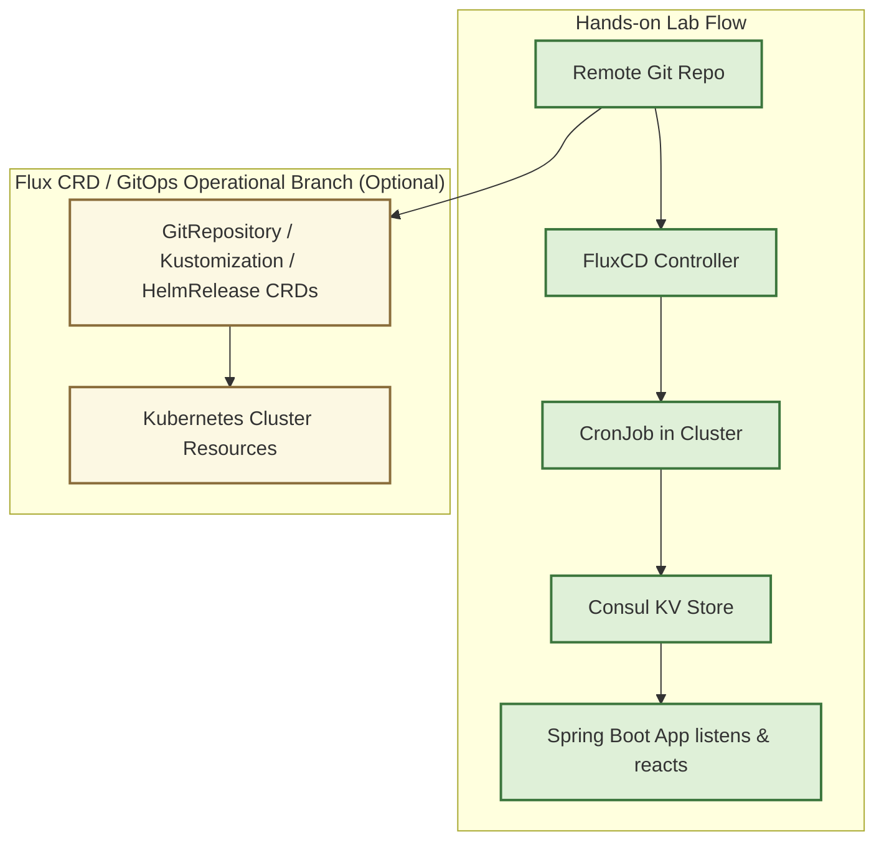

# Hands-on-Lab.FluxCD-Consul-SpringBoot
_Deploy a Spring Boot app with dynamic Consul KV configuration on local Kubernetes using FluxCD GitOps._

**Focus**: Microservice dynamic configuration with Consul KV integration via FluxCD GitOps. 

## Project Overview 
This repository is a **hands-on**, **lightweight**, and **verifiable lab** for exploring:
- GitOps with FluxCD
- Dynamic configuration management with Consul KV
- Spring Boot microservices dynamically reacting to configuration changes


### Key Goals
- Portable local Kubernetes environment using Kind
- Remote Git repo → Flux detects changes → CronJob syncs → Consul KV → Spring Boot app
- Hands-on, minimal setup, theory & practice combined
> Note: Flux CRDs (GitRepository, Kustomization, HelmRelease) are a separate operational path for GitOps management of Kubernentes resources. This repo does not explore that branch in detail--another repo will cover it. 

## Diagram Flow 


## Project Structure 

```
Hands-on-Lab.FluxCD-Consul-SpringBoot/
│
├── spring-boot-app/              # Spring Boot application source code
│   ├── src/
│   │   └── main/java/...        
│   └── pom.xml                   # Maven build file (Jib used for Docker image)
│
├── k8s/                          # Kubernetes manifests for deployment
│   ├── spring-app.yaml           # Deployment + Service for Spring Boot app
│   └── consul-sync-job.yaml      # CronJob to sync Git repo configs to Consul KV
│
├── config/                       # Configuration for local lab
│   └── kind-config.yml           # Kind cluster config: control-plane & nodes, exposed ports
│
├── scripts/
│   └── kind-create-cluster.sh    # Helper script to create local Kind cluster
│
└── README.md                     # This file
```

**Notes on structure**
- `spring-boot-app/`: contains the demo Spring Boot app and maven pom.xml using Jib to build and push Docker images. 
- `k8s/`: manifest for Spring Boot deployment and Consul sync CronJob.
- `config/`: Kind cluster nodes and port mapping (NodePort/hostPort)
- `scripts:/`: helper scripts for local setup.
- Remote Git repo URL & branch are specified in Flux commands, not stored in Kind config

## Environment & Project Info 
### Development Environment 
- OS: macOS
- Java: JDK17
- Spring Boot: 3.x
- Spring Cloud: 2023.x (Spring Cloud Consul support)
- Maven: 3.9.x
- Docker: latest
- Kind: latest
- kubectl: latest
- Helm: v3+
- Flux CLI: v0.38
- Git: latest 


### Project Stack
- **Kubernentes (local)**: Kind cluster 
- **GitOps**: FluxCD 
- **Configuration Store**: Consul (KV store)
- **Spring Boot App**: Spring Boot app dynamically reading configuraiton from Consul 

## Hands-on Lab Flow 
### Create a local Kind cluster using `config/kind-config.yml`:

```bash 
kind create cluster --name hands-on-flux --config config/kind-config.yml
```
> `config/kind-config.yml` includes Kind nodes configuration. 

### Install Consul using Helm 
```bash 
kubectl create ns consul
helm repo add hashicorp https://helm.releases.hashicorp.com
helm repo update
helm install consul hashicorp/consul -n consul
kubectl get pods -n consul
```

### Install FluxCD 
```bash 
flux install
kubectl get pods -n flux-system
```

### Configure GitOps source repository 
```bash 
flux create source git shared-config \
  --url=https://github.com/<github_user>/<github_repo> \
  --branch=main \
  --sub-path=apps/spring-consul-app \ 
  --interval=1m \
  --export > shared-config-source.yaml
kubectl apply -f shared-config-source.yaml
```

**Parameters explained**:
- `--url`: Remote Git repo URL
- `--branch`: branch to monitor 
- `--interval`: polling interval
- `--sub-path`: specific directory inside the repo to monitor (optional)
    > use this to restrict Flux to only watch the hands-on lab configuration,
    > avoiding triggers from unrelated files 
- `--export`: saves the Kubernetes CRD YAML locally for `kubectl apply`

> Note: This export generated YAML is only for K8S to load. Flux will monitor the **remote Git repo**, and this YAML does not directly affect Consul or Spring Boot app. 

### Deploy CronJob to sync Git -> Consul KV
```bash 
kubectl apply -f k8s/consul-sync-job.yaml
```

### Deploy Spring demo app(s)
```bash 
kubectl apply -f k8s/spring-app.yaml
```

### Verify dynamic configuration 
- Modify the **remote Git repo**'s `applicaiton.prod.yaml` and push to GitHub.
- Flux detects the **change** -> triggers **CronJob** -> updates **Consul KV**
- Spring Boot app listens to Consul -> logs events or parse configuraiton changes. 


## CRD Branch (Optional / Not Covered)
- Flux CRDs (GitRepository, Kustomization, HelmRelease) manage cluster-level resources.
- This repo does not explore this branch in detail.
- A separate repo will cover Flux CRDs, GitOps resource management, and deeper operational scenarios.


## Summary
- Focus: Spring Boot microservice + ConsulKV + FluxCD GitOps
- Hands-on: Remote Git repo changes -> Flux -> CronJob -> Consul -> Spring App/K8s Svc
- Operational CRD path: Exists but not explored here 
